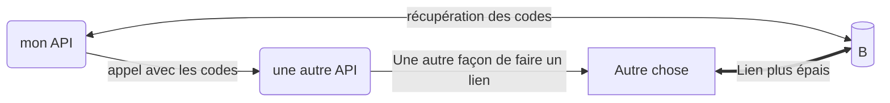
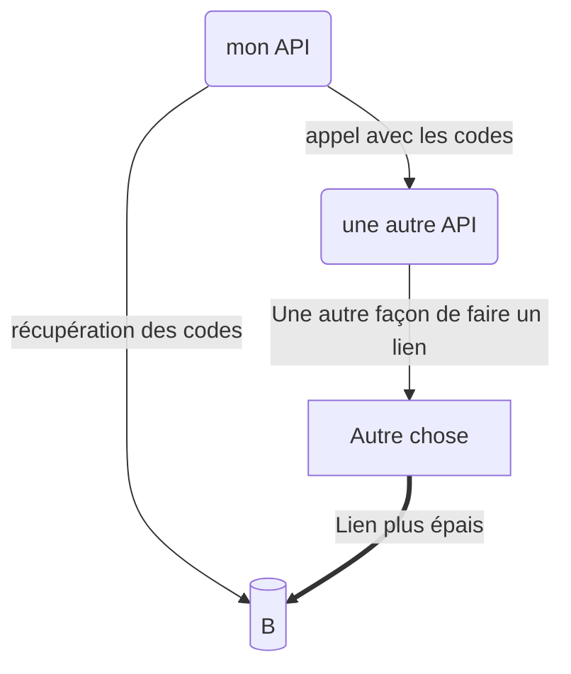
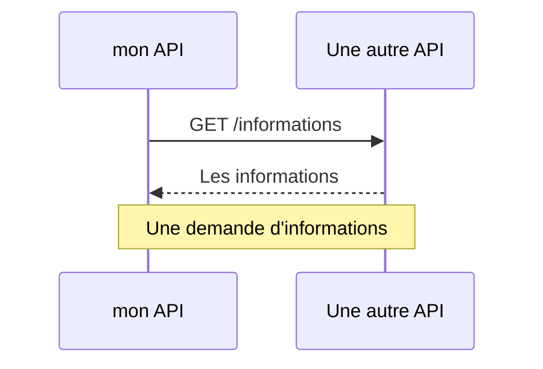
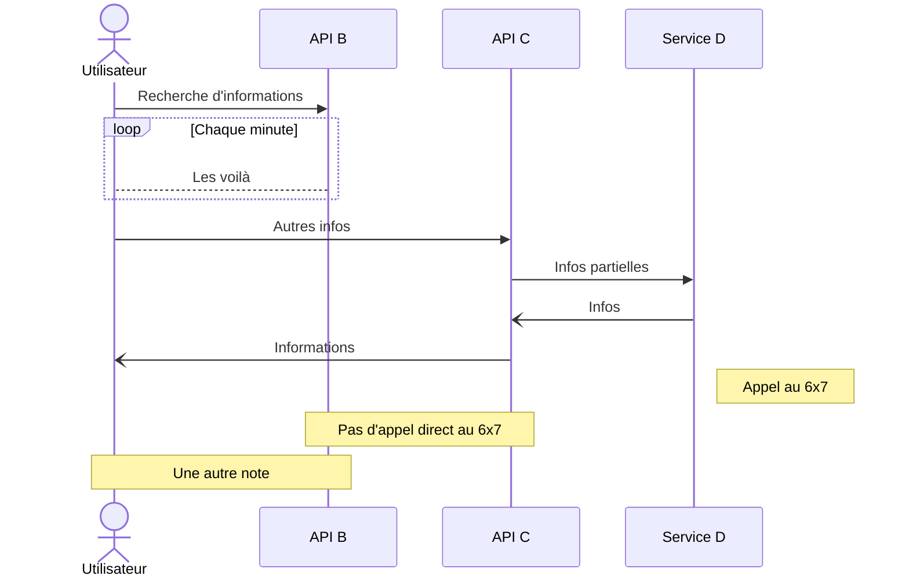

# Tables
Voici l'exemple d'une table. 


{: style="height:80px" align=left }


## Où vit-on le mieux en France? 
:wink: Le Cadran pour l'Express

| Ville         | Population (en millions) | Département           | Région                   |
|---------------|--------------------------|-----------------------|--------------------------|
| Paris         | 2.14                     | Paris (75)            | Île-de-France            |
| Marseille     | 0.86                     | Bouches-du-Rhône (13) | Provence-Alpes-Côte d'Azur |
| Rennes        | 0.22                     | Ille-et-Vilaine (35)  | Bretagne                 |
| Bordeaux      | 0.25                     | Gironde (33)          | Nouvelle-Aquitaine       |
| Lorient       | 0.21                     | Morbihan (56)         | Bretagne                 |

!!! note
    L'ordre des villes ne represente pas leur classement. 

# Mermaid

Mermaid permet de décrire des schémas en symboles qui seront traduits au rendu de la page web.

Source : [mermaid](https://mermaid.js.org/intro/)

## Diagrammes 

Documentation : [mermaid](https://mermaid.js.org/syntax/flowchart.html)



````

````



````

````

## Diagrammes de séquence



````

````



````

````

